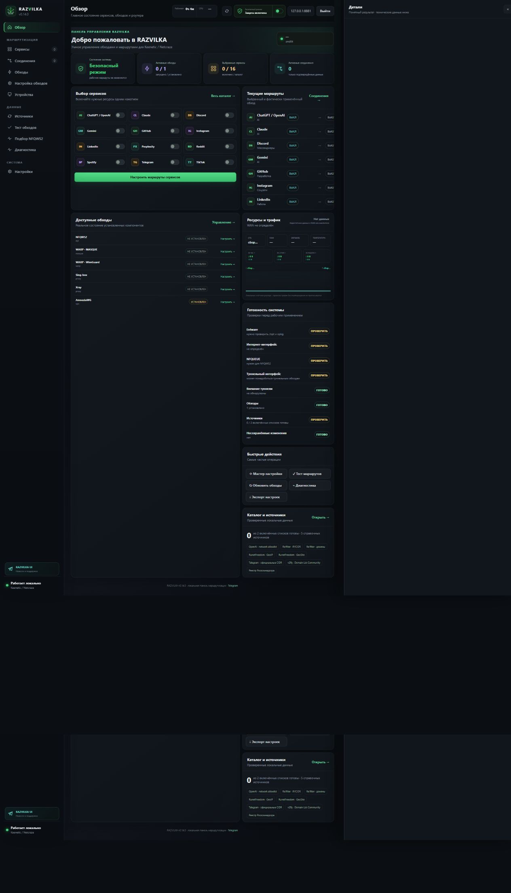
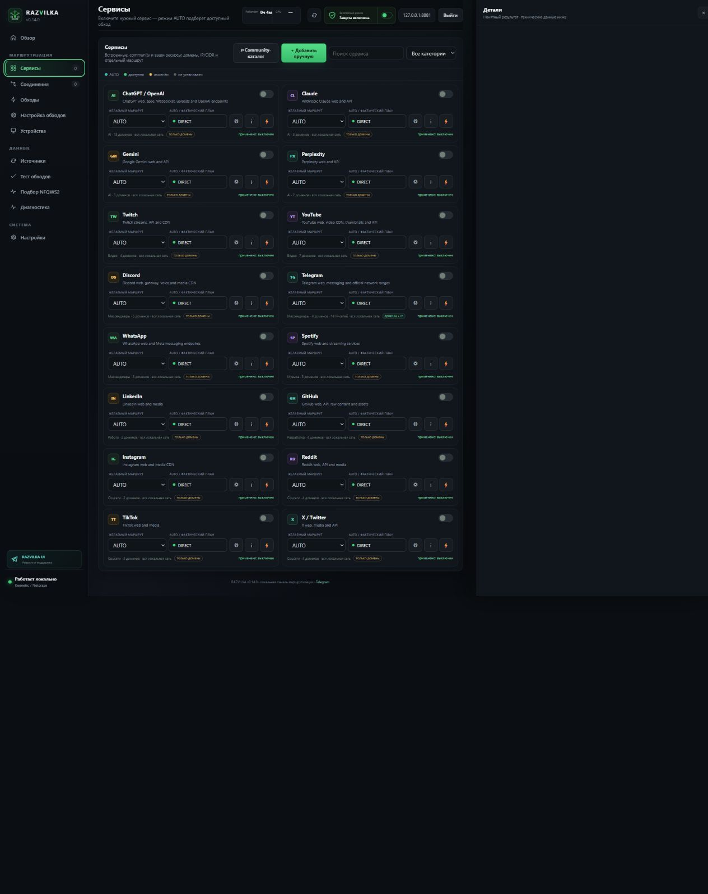

<p align="center"></p>

<p align="center"><strong>Выберите сервис — RAZVILKA подберёт, проверит и безопасно применит подходящий маршрут.</strong></p>

<p align="center"><a href="README_EN.md">English</a> · <a href="https://t.me/RAZVILKA_UI">Telegram</a> · <a href="https://github.com/ArtixSx/RAZVILKA/releases">Скачать</a> · <a href="SECURITY.md">Безопасность</a></p>

<p align="center">
  
  
  
  
</p>

# RAZVILKA

RAZVILKA — бесплатная локальная панель управления доступом к сервисам для роутеров Keenetic/Netcraze с Entware. Пользователь включает Telegram, YouTube, Discord, ChatGPT или собственный ресурс, а приложение управляет доменами и IP-сетями, сравнивает доступные обходы и применяет выбранный маршрут с резервной копией и автоматическим возвратом при ошибке.

Панель, учётная запись, конфигурации и диагностические данные находятся на роутере. Внешняя регистрация RAZVILKA и облачный аккаунт не нужны.

> Проект находится до версии `1.0.0`: интерфейс пригоден для аппаратного тестирования, но массовый релиз будет объявлен только после расширенной матрицы роутеров, перезагрузок, IPv6, low-memory и аварийного восстановления.

## Установка

Заранее включите Entware на накопителе, подключитесь к роутеру по SSH как `root` и выполните одну команду:

```sh
curl -fsSL https://raw.githubusercontent.com/ArtixSx/RAZVILKA/main/scripts/bootstrap.sh | sh
```

Если доступен только `wget`:

```sh
wget -qO- https://raw.githubusercontent.com/ArtixSx/RAZVILKA/main/scripts/bootstrap.sh | sh
```

Установщик проверяет Entware и архитектуру, сверяет SHA-256 релиза, делает снимок для возврата, запускает панель и печатает локальный адрес вместе с одноразовым ключом первого входа. Универсального пароля `admin/admin` нет.

По умолчанию устанавливается только UI. Нужные обходы добавляются из раздела **«Обходы»**, поэтому слабый роутер не расходует память на неиспользуемые компоненты. Поддерживаются `arm64`, `mips`, `mipsle` и `amd64`.

## Как это выглядит





## Три шага

1. В разделе **«Обходы»** установите предложенный компонент.
2. В **«Сервисах»** включите нужное приложение и оставьте `AUTO` либо закрепите маршрут вручную.
3. Запустите **«Тест обходов»**, проверьте план и подтвердите рабочий режим.

Safe Mode включён после установки и не меняет firewall, DNS, TUN или policy routing без явного действия пользователя.

## Какой обход выбрать

| Обход | Когда подходит | Что требуется |
|---|---|---|
| **NFQWS2** | DPI-фильтрация, замедление и доменные блокировки | внешний сервер не нужен |
| **WARP · MASQUE** | полная блокировка по IP; MASQUE QUIC/UDP 443 с проверкой TCP/443 как запасного пути | доступ к Cloudflare, пакеты usque и sing-box |
| **WARP · WireGuard** | бесплатный split-туннель, когда UDP Cloudflare отвечает | профиль wgcf и успешный handshake |
| **Sing-box** | VLESS/Reality, Hysteria2, TUIC, Shadowsocks; TCP/UDP и IP-сети | свой удалённый сервер или готовый профиль |
| **Xray** | альтернативный VLESS/Reality-клиент | свой удалённый сервер |
| **AmneziaWG** | обычный WireGuard распознаётся или блокируется DPI | совместимый AmneziaWG-сервер и runtime |

Генератор WARP создаёт ключи и профиль, но сам по себе не является обходом. RAZVILKA не показывает установленный бинарник как работающий маршрут.

## Полная блокировка Telegram и других приложений

Доменного списка недостаточно, если приложение подключается прямо к IP-адресам. Для Telegram RAZVILKA использует одновременно веб-домены и официальные IPv4/IPv6 CIDR Telegram, включая сети MTProto и media/CDN. Обновляемый источник привязан только к Telegram и не может случайно расширить маршруты других сервисов.

При полной IP-блокировке `AUTO` предпочитает подтверждённый туннель: MASQUE, Sing-box, AmneziaWG или WARP WireGuard. NFQWS2 остаётся резервом для DPI-сценариев, но не выдаётся за универсальную замену туннеля.

Пользовательские сервисы можно добавлять вручную с доменами, IP/CIDR, проверочным URL и отдельным маршрутом.

## Проверка WARP

Панель различает три независимых этапа:

- TLS-доступ к API регистрации Cloudflare;
- доступность MASQUE endpoint по TCP/443 как запасного транспорта;
- настоящий WireGuard handshake на UDP `2408`, `500`, `1701` или `4500` во время транзакционного Apply.

Если новый WARP-маршрут не проходит проверку, RAZVILKA удаляет временный интерфейс и правила, возвращает предыдущий рабочий маршрут и сохраняет черновик для исправления. Если Cloudflare недоступен целиком, панель предлагает туннель со своим сервером вместо бесконечной перегенерации одинаковых профилей.

## Возможности

- изолированное сравнение маршрутов; в `AUTO` участвует только подтверждённый путь;
- HTTP-статус, TTFB и проверка ограниченного фрагмента потока;
- подбор стратегий обычного NFQWS2 в Strategy Lab без установки z2k как второго сервиса;
- CPU, RAM, Entware, температура и локальный WAN-трафик;
- проверки NFQUEUE, TProxy, socket match, ipset, conntrack, TUN и конфликтующих процессов;
- маршруты для отдельных устройств и групп локальной сети;
- публичные профили и зашифрованные приватные backup;
- применение по схеме `plan → snapshot → validate → health → commit/rollback`.

## Обновление и восстановление

Повторите команду установки. Учётная запись, пользовательские сервисы, конфиги обходов и подтверждённое состояние сохраняются. Последний снимок находится по указателю `/opt/var/lib/razvilka/current-backup`.

Архитектура описана в [docs/ARCHITECTURE.md](docs/ARCHITECTURE.md), критерии массового выпуска — в [docs/ROADMAP.md](docs/ROADMAP.md).

## Поддержка

- Telegram: [@RAZVILKA_UI](https://t.me/RAZVILKA_UI)
- Ошибки и предложения: [GitHub Issues](https://github.com/ArtixSx/RAZVILKA/issues)
- Лицензия: [MIT](LICENSE)
