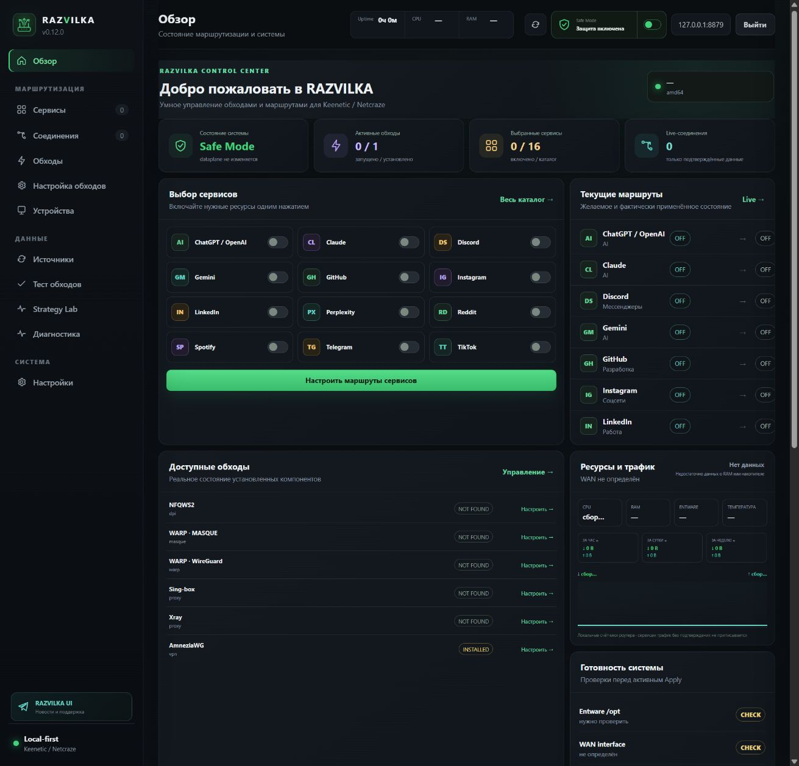
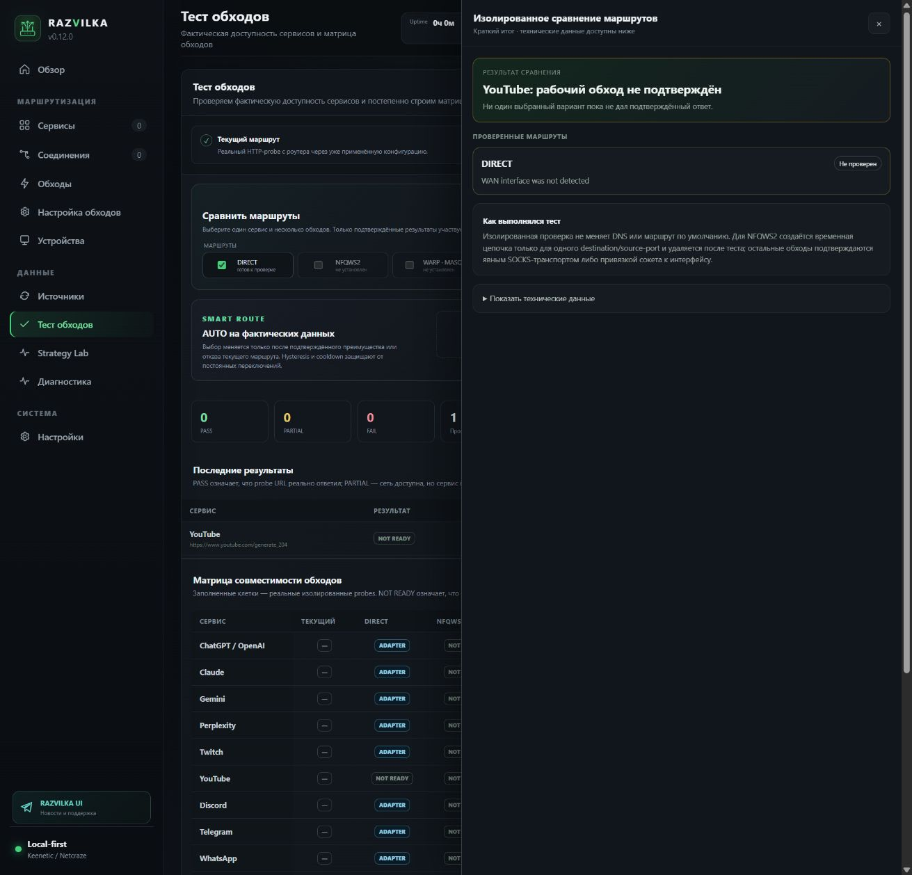
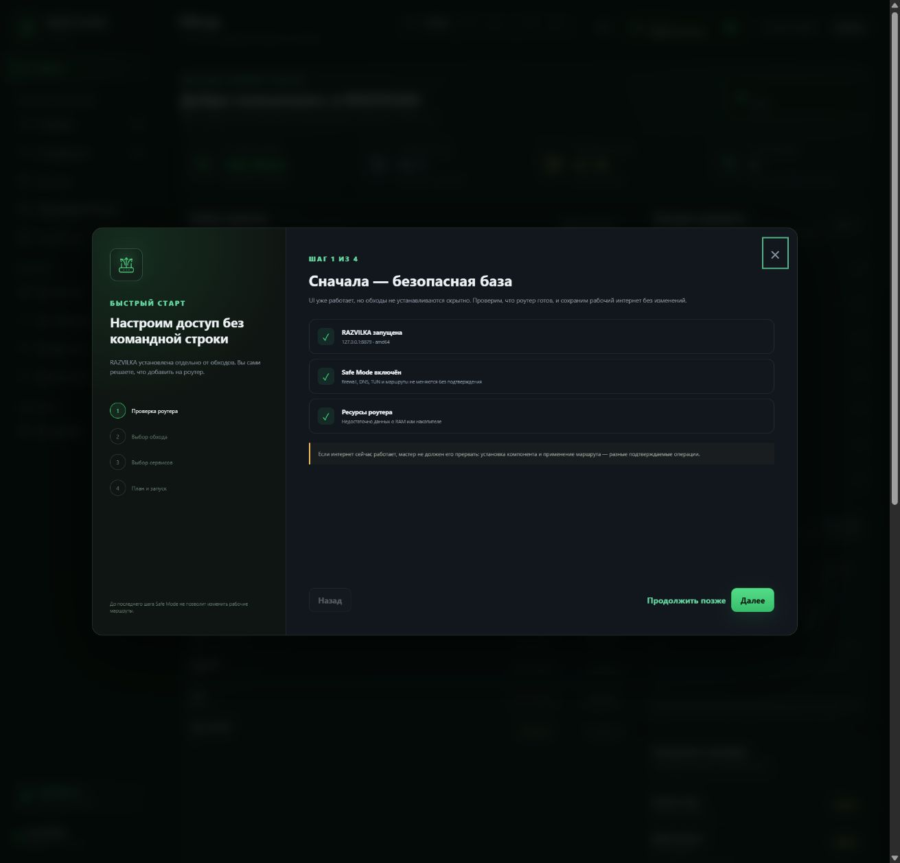

<p align="center">
  
</p>

<p align="center">
  <a href="README_RU.md">Русский</a> ·
  <a href="https://t.me/RAZVILKA_UI">Telegram</a> ·
  <a href="https://github.com/ArtixSx/RAZVILKA/releases">Releases</a> ·
  <a href="SECURITY.md">Security</a>
</p>

<p align="center">
  
  
  
</p>

# RAZVILKA

RAZVILKA is a free local-first routing control center for Keenetic/Netcraze routers. Users select the apps and websites they need; RAZVILKA installs optional bypass components, tests available paths and assigns a confirmed route per service.

No cloud account is required. The UI, credentials, configuration and diagnostics remain on the router.

## Highlights

- One-switch service catalog for YouTube, Discord, Telegram, ChatGPT, Spotify and more.
- UI-only default installation; add only the bypasses the router actually needs.
- Unified control for NFQWS2, WARP/MASQUE, WARP/WireGuard, sing-box, Xray and AmneziaWG.
- Isolated route probes with TTFB and a bounded 32 KiB response-integrity sample; only confirmed evidence affects `AUTO`.
- NFQWS2 Strategy Lab inspired by practical z2k workflows, without installing z2k as a duplicate runtime.
- Live CPU, RAM, Entware, WAN traffic and router-capacity indicators.
- Read-only NFQUEUE, TProxy, socket-match, ipset and conntrack readiness checks.
- Custom services, domain/CIDR lists, checked sources and encrypted private backups.
- Transactional `plan → snapshot → validate → health → commit/rollback` apply flow.

## One-command installation

Enable Entware storage first, then connect to the router over SSH as `root`:

```sh
curl -fsSL https://raw.githubusercontent.com/ArtixSx/RAZVILKA/main/scripts/bootstrap.sh | sh
```

`wget` alternative:

```sh
wget -qO- https://raw.githubusercontent.com/ArtixSx/RAZVILKA/main/scripts/bootstrap.sh | sh
```

The guided installer checks Entware and architecture, downloads the stable release bundle, verifies SHA-256, creates a rollback snapshot, starts RAZVILKA and prints the local UI URL.

The default install contains only the UI/control plane. Install individual bypasses from **Bypasses**, or explicitly request the starter pack:

```sh
curl -fsSL https://raw.githubusercontent.com/ArtixSx/RAZVILKA/main/scripts/bootstrap.sh | sh -s -- --starter-pack
```

Supported architectures: `arm64`, `mips`, `mipsle`, `amd64`.

## First login

A fresh installation prints a unique setup/recovery key and a local setup URL. Open it and create your own username and password. RAZVILKA intentionally has no universal `admin/admin` credential and never imports the router SSH password.

Upgrades preserve the UI account and do not echo the recovery secret again.

## Three-step setup

1. Open **Bypasses** and install NFQWS2 or another required component.
2. Enable services and keep `AUTO`, or pin a route manually.
3. Run **Route tests**, review the plan, then leave Safe Mode only when ready for Active Apply.

Safe Mode is enabled on first installation and prevents firewall, DNS, TUN and policy-routing writes until explicit confirmation.

## UI



Route comparison is human-readable; raw API data is kept under a collapsed technical-details section.





## Components

| Component | Purpose | Provisioning |
|---|---|---|
| NFQWS2 | local DPI desynchronization / Zapret2 | UI or starter pack |
| WARP · MASQUE | Cloudflare WARP through usque | UI when a compatible package is available |
| WARP · WireGuard | generated WARP profile and policy route | UI |
| WARP Generator | generate, validate, import and replace a profile | UI |
| sing-box / Xray | VLESS, Reality, Hysteria2, TUIC, Shadowsocks | UI with a user profile |
| AmneziaWG | DPI-resistant WireGuard-compatible tunnel | compatible kernel/repository required |

Package availability depends on architecture, KeeneticOS and configured opkg repositories. Missing components are never reported as active, and routes are not selected without health evidence.

## Update and rollback

Run the installation command again. User services, credentials, bypass configs and committed dataplane state are preserved.

The latest snapshot path is stored in `/opt/var/lib/razvilka/current-backup`. See [README_RU.md](README_RU.md) and [docs/ARCHITECTURE.md](docs/ARCHITECTURE.md) for detailed recovery and design notes.

## Validation

```sh
./scripts/check.sh
```

The release gate runs Go tests, the race detector, vet, JavaScript/shell syntax checks, Linux cross-builds for all supported architectures, SHA-256 verification and a transactional Entware apply/rollback test.

## Support

- Telegram: [@RAZVILKA_UI](https://t.me/RAZVILKA_UI)
- Bugs and feature requests: [GitHub Issues](https://github.com/ArtixSx/RAZVILKA/issues)
- Vulnerability reports: [SECURITY.md](SECURITY.md)

RAZVILKA is free software under the [MIT License](LICENSE).
