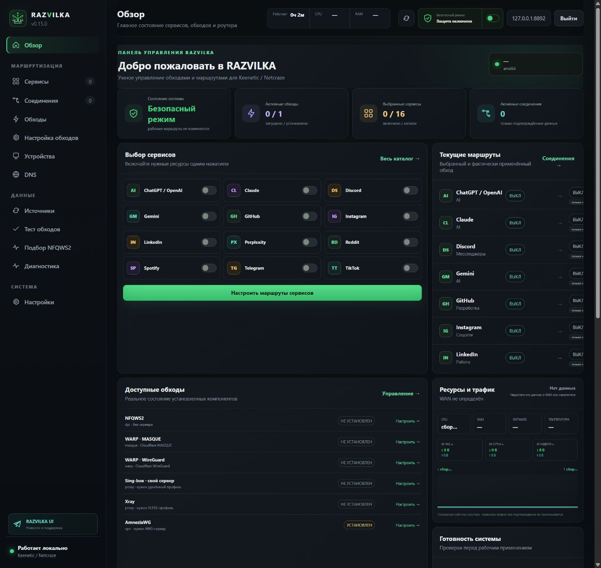
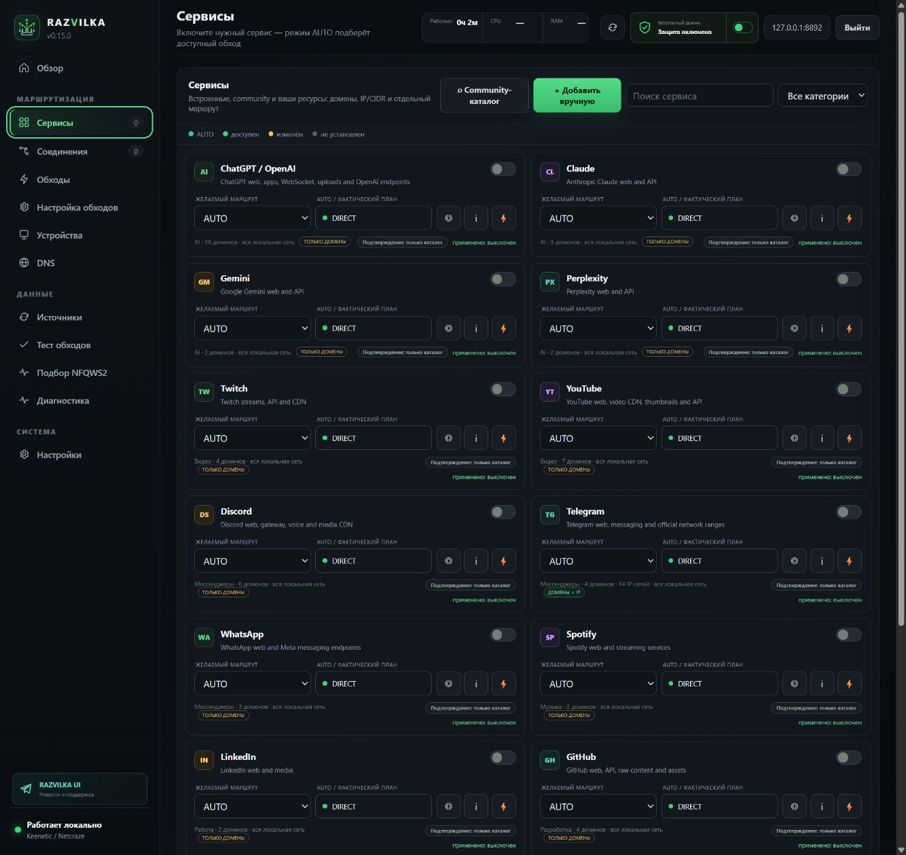

<p align="center"></p>

<p align="center"><strong>Выберите сервис — RAZVILKA проверит доступные обходы и поможет безопасно применить подходящий маршрут.</strong></p>

<p align="center">
  <a href="README_EN.md">English</a> ·
  <a href="https://github.com/ArtixSx/RAZVILKA/releases">Скачать и обновить</a> ·
  <a href="https://t.me/RAZVILKA_UI">Telegram</a> ·
  <a href="SECURITY.md">Безопасность</a>
</p>

<p align="center">
  
  
  
  
</p>

# RAZVILKA

RAZVILKA — бесплатная локальная панель для Keenetic/Netcraze с Entware. Включите Telegram, YouTube, Discord, ChatGPT или собственный ресурс, а панель соберёт его домены и IP-сети, сравнит доступные обходы и подготовит безопасный план применения.

Учётная запись, конфигурации и диагностика находятся на роутере. Облачная регистрация RAZVILKA не требуется.

> Проект ещё проходит аппаратное тестирование. Версия `1.0.0` будет выпущена после проверки разных моделей роутеров, IPv4/IPv6, перезагрузок, low-memory и аварийного восстановления.

## Установка

Нужен роутер с Entware и SSH-доступом `root`. На полностью новом роутере сначала
установите Entware на накопитель средствами Keenetic/Netcraze и убедитесь, что
каталог `/opt` подключён. Универсальной безопасной командой установить сам
Entware нельзя: разметка накопителя и имя компонента зависят от модели и
прошивки.

Для Keenetic используйте только установщик Entware своей архитектуры. Проверить
архитектуру можно командой `uname -m`:

| Результат `uname -m` | Entware для Keenetic |
|---|---|
| `aarch64` / `arm64` | [`aarch64-k3.10`](https://bin.entware.net/aarch64-k3.10/installer/aarch64-installer.tar.gz) |
| `mips` | [`mipssf-k3.4`](https://bin.entware.net/mipssf-k3.4/installer/mips-installer.tar.gz) |
| `mipsel` / `mipsle` | [`mipselsf-k3.4`](https://bin.entware.net/mipselsf-k3.4/installer/mipsel-installer.tar.gz) |

Не выбирайте установщик только по названию модели: сначала сравните вывод
`uname -m`. Сборка RAZVILKA `amd64` предназначена для других совместимых
Entware/Linux-систем и не является вариантом для Keenetic.

### 1. Подготовка чистого Entware

Подключитесь по SSH и проверьте окружение:

```sh
test -d /opt && command -v opkg && echo "Entware готов"
opkg update
opkg install ca-certificates coreutils-sha256sum tar
```

Затем установите **один** HTTPS-загрузчик. Рекомендуемый вариант:

```sh
opkg install curl
```

Если `curl` недоступен или вы предпочитаете `wget`:

```sh
opkg install wget-ssl
```

Если `opkg` сообщает о конфликте с `wget-nossl`, сначала удалите только этот
пакет и повторите установку TLS-версии:

```sh
opkg remove wget-nossl
opkg install wget-ssl
```

### 2. Установка RAZVILKA

С `curl`:

```sh
curl -fsSL https://raw.githubusercontent.com/ArtixSx/RAZVILKA/main/scripts/bootstrap.sh | sh
```

С `wget`:

```sh
wget -qO- https://raw.githubusercontent.com/ArtixSx/RAZVILKA/main/scripts/bootstrap.sh | sh
```

Установщик проверит архитектуру и Entware, сверит SHA-256 релиза, создаст резервную копию и напечатает локальный адрес панели с одноразовым ключом первого входа. После входа задайте собственный логин и пароль.

По умолчанию устанавливается только UI. Нужные обходы добавляются позже из раздела **«Обходы»**, поэтому память роутера не занята неиспользуемыми компонентами.

### 3. Проверка установки

```sh
/opt/bin/razvilka -version
/opt/etc/init.d/S99razvilka status
LAN_IP=$(/opt/etc/init.d/S99razvilka lan-ip)
/opt/bin/razvilka -healthcheck "http://$LAN_IP:8787/api/v1/status"
```

Успешная проверка показывает версию, строку `RAZVILKA healthy` и
`healthy: <версия>`. Если проверка не прошла, не включайте рабочий режим:

```sh
/opt/bin/razvilka doctor
tail -n 120 /opt/var/log/razvilka/razvilka.log
```

В разделе **«Обходы»** после каждой установки отображаются отдельно:
фактически установленная версия, подтверждение контрольной операции,
состояние настройки и запущен ли процесс. Сообщение «доступен» не означает
«установлен», а «установлен» не выдаётся за работающий маршрут без проверки.

## Интерфейс

<p align="center">
  
  
</p>

## Как пользоваться

1. Откройте **«Обходы»** и установите подходящий компонент.
2. В **«Сервисах»** включите нужный ресурс и оставьте **«Автопилот (AUTO)»** либо выберите маршрут вручную.
3. Нажмите **«Сохранить и проверить»**. RAZVILKA сама проверит кандидат, применит его и вернёт прежний интернет при ошибке. Отдельный тест нужен только для ручной диагностики.

Safe Mode включён после установки: без явного подтверждения панель не меняет firewall, DNS, TUN и policy routing.

## Что поддерживается

| Обход | Для чего нужен |
|---|---|
| **NFQWS2** | DPI-фильтрация, замедление и доменные блокировки без внешнего сервера |
| **WARP · MASQUE** | Полная блокировка по IP через Cloudflare MASQUE, если транспорт доступен |
| **WARP · WireGuard** | Бесплатный split-туннель после подтверждённого handshake |
| **Sing-box** | VLESS/Reality, Hysteria2, TUIC и Shadowsocks через собственный сервер или профиль |
| **Xray** | Альтернативный клиент VLESS/Reality |
| **AmneziaWG** | Туннель к совместимому AmneziaWG-серверу, когда обычный WireGuard распознаётся сетью |

RAZVILKA также предоставляет:

- каталог сервисов и ручное добавление доменов/IP/CIDR;
- отдельные сценарии проверки Telegram, включая Web и Core/API;
- подбор и память подтверждённых стратегий обычного NFQWS2;
- DNS-профили с проверкой доступности и безопасным планом;
- маршруты для отдельных устройств и групп;
- CPU, RAM, Entware, температуру и локальный WAN-трафик;
- экспорт публичных профилей и зашифрованные приватные резервные копии;
- транзакционное применение `plan → snapshot → stage → validate → canary → activate → health → commit/rollback`;
- предварительный canary для Sing-box, Xray и WARP · MASQUE: временный
  loopback SOCKS-кандидат проверяется и удаляется до изменения рабочего TUN и
  policy routing;
- автопилот для AUTO-сервисов: текущий маршрут, DIRECT-контроль и одна
  альтернатива проверяются с ограниченной частотой; переключение выполняется
  только по подтверждённым данным и через транзакцию с rollback;
- безопасный импорт списков VLESS/Hysteria2/TUIC/Shadowsocks: Sing-box локально
  выбирает доступный узел из ограниченного URLTest-пула, а одиночный публичный
  ключ не считается рабочим до реального handshake и запроса сервиса;
- отдельную безопасную проверку WARP · WireGuard: временный интерфейс проверяет
  handshake на официальных UDP-портах Cloudflare, `warp=on` и выбранный сервис,
  после чего полностью удаляется. Отказ не меняет рабочий маршрут. Для NFQWS2
  и AmneziaWG отдельные аппаратные canary ещё разрабатываются.

## Рекомендации

- Не публикуйте порт панели в интернет — используйте её только из локальной сети.
- Не отключайте Safe Mode до успешной диагностики и проверки выбранного обхода.
- Для полной IP-блокировки используйте подтверждённый туннель; NFQWS2 предназначен прежде всего для DPI-сценариев.
- Перед обновлением сохраните резервную копию. Повторный запуск установщика сохраняет пользовательские настройки.

## Обновления и поддержка

Описание каждой версии, совместимость и файлы загрузки находятся только в [GitHub Releases](https://github.com/ArtixSx/RAZVILKA/releases).

- Новости и помощь: [@RAZVILKA_UI](https://t.me/RAZVILKA_UI)
- Ошибки и предложения: [GitHub Issues](https://github.com/ArtixSx/RAZVILKA/issues)
- Техническая архитектура: [docs/ARCHITECTURE.md](docs/ARCHITECTURE.md)
- Лицензия: [MIT](LICENSE)
